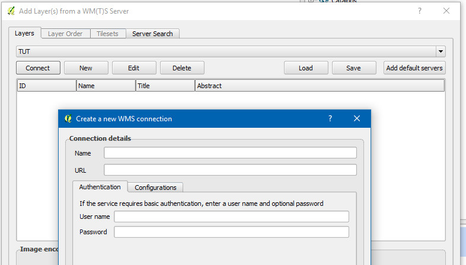
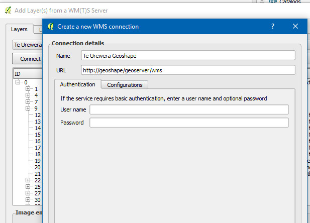

.. _qgis:

QGIS
=====

Quantum GIS or QGIS is an open source, cross platform desktop GIS app. It can also be used to add layers from your Geoshape instance as WMS or WFS. We will walk through the steps necessary in the following section.

First, select "Add WMS Layer" from the Layer menu.

The Add WMS Layer Dialog will be displayed where you are able to specify the parameters to connect to your WMS server. 

Next, you need to fill in the parameters to connect to your Geoshape instance. The URL for your Geoshape's WMS is the base URL + /geoserver/wms 

After clicking the OK button, your server will show up in the list of servers. Make sure its selected, then, click the connect button to have QGIS retrieve the list of layers from your Geoshape.

Select the layers you want to add to your QGIS project and click "Add".

Your layer will be displayed in the map panel.

Adding WFS servers and layers to your QGIS project is very similar to adding WMS. Depending on your version of QGIS, you may need to add the WFS plugin.

First, select "Add WFS Layer" from the Layer menu.

Step through the same process you did for WMS to create a new WFS connection. First specify server parameters and click OK.

Then click Connect to retrieve the list of layers on the server and select the layers you want to add and click Apply.

The layer(s) you selected will be displayed in the map panel.

To look at more information about your layer, right click the layer in the Table of Contents and select Layer Properties. You can look at the list of fields.

... or set a style to match how you want your data to be displayed.

.. figure:: img/en_qgis_wfs_style.jpg

You now know how to add layers from your Geoshape instance to a QGIS project. You can explore all of the other options available to you in QGIS by consulting its documentation.